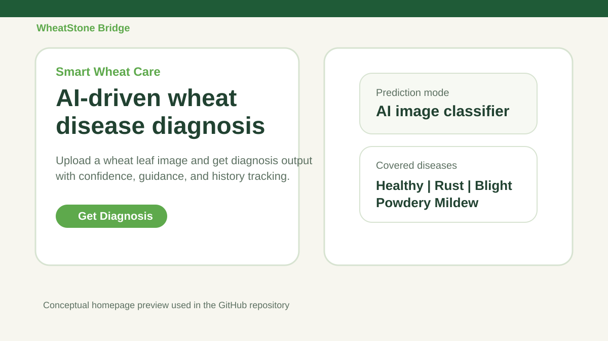
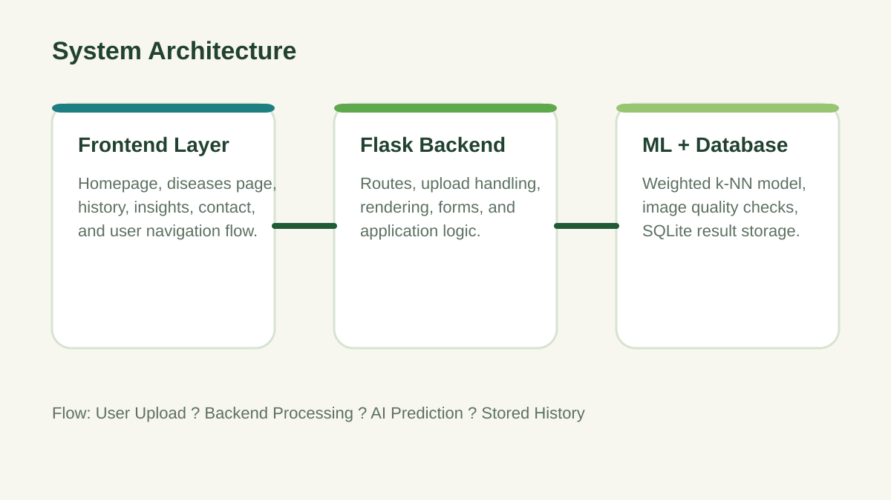

# WheatStone Bridge


WheatStone Bridge is an AI-driven wheat leaf disease detection web application built as a final year project.  
It helps users upload a wheat leaf image, detect the likely disease class, and understand crop-health conditions through a clean web interface.

## Project Preview





## Project Highlights

- Wheat-only disease detection platform
- Flask-based backend with live image upload flow
- Trained lightweight machine learning classifier
- Disease classes: `Healthy`, `Rust`, `Leaf Blight`, `Powdery Mildew`
- Diagnosis history storage with SQLite support
- Product-style frontend for presentation and demo

## Tech Stack

- `Python`
- `Flask`
- `HTML`
- `CSS`
- `JavaScript`
- `SQLite`
- `Machine Learning`

## Screens and Modules

- `Home`: live wheat leaf image upload and diagnosis flow
- `Diseases`: wheat disease library and symptom guide
- `About`: project and platform overview
- `Insights`: feature and capability summary
- `History`: stored diagnosis results
- `Contact`: support and communication page

## How It Works

1. User uploads a wheat leaf image.
2. The system checks basic image quality.
3. Visual features are extracted from the image.
4. The trained classifier predicts the likely disease class.
5. The result is shown with confidence and short guidance.
6. The diagnosis is stored in history for review.

## Machine Learning Summary

- Model type: `Weighted k-NN classifier`
- Dataset size: `999 mapped wheat leaf images`
- Classes: `4`
- Best `k`: `9`
- Validation accuracy: `50.00%`

## Project Documents

- [Project Report](docs/WheatStone_Bridge_Report.md)
- [Presentation Notes](docs/WheatStone_Bridge_Presentation_Notes.md)

## Run Locally

```powershell
python -m pip install -r requirements.txt
python app.py
```

Then open:

```text
http://127.0.0.1:5000
```

## Folder Structure

```text
WheatStone-Bridge-GitHub/
  app.py
  database.py
  utils.py
  requirements.txt
  model/
  static/
  templates/
  assets/
  docs/
```

## Project Purpose

This project demonstrates how machine learning and web development can be combined to create a practical agriculture support platform for wheat disease screening and awareness.
